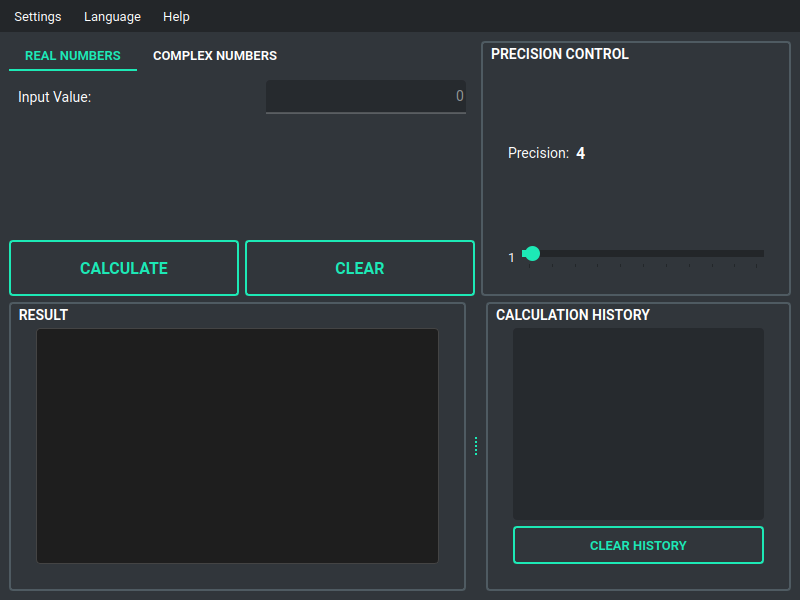

# Square Root Calculator

> **English version** | **[Русская версия](README.ru.md)**

A comprehensive, cross-platform square root calculator with support for real numbers, complex numbers, and arbitrary precision calculations.

## Screenshots

### Initial Interface
<div align="center">
  
  <p><i>Initial interface with English language</i></p>
</div>

### Multilingual Support
<div align="center">
  
  <p><i>Russian language interface</i></p>
</div>

### Real Number Calculations
<div align="center">
  
  <p><i>Calculating √2 with 30 decimal places precision</i></p>
</div>

<div align="center">
  
  <p><i>Computing square root of large numbers (123,456,789)</i></p>
</div>

### Complex Number Support
<div align="center">
  
  <p><i>Complex number mode interface</i></p>
</div>

<div align="center">
  
  <p><i>Calculating √(3+4i) = 2+1i</i></p>
</div>

<div align="center">
  
  <p><i>Computing √(-1) = i in complex mode</i></p>
</div>

## Features

### Core Functionality
- **Real Number Support**: Calculate square roots of positive real numbers
- **Complex Number Support**: Calculate square roots of complex numbers (a + bi)
- **Arbitrary Precision**: Configure calculation precision from 1 to 1000 decimal places
- **Multiple Roots Display**: Shows both positive and negative square roots
- **Multiple Representations**: Decimal, scientific notation, and fractional approximations

### User Interface
- **Modern GUI**: Built with PyQt6 for a native look and feel
- **Tab-Based Navigation**: Intuitive switching between Real and Complex modes
- **Precision Control**: Slider (1-200) for quick adjustments + spinbox (1-1000) for exact values
- **Unified Output Format**: Consistent display across all calculation modes
- **Calculation History**: Side panel showing recent calculations with timestamps

### Additional Features
- **Multilingual Interface**: Support for English and Russian languages
- **Update Checker**: Automatic check for new versions from GitHub
- **Error Handling**: Robust input validation and error messages
- **Cross-Platform**: Works on Windows, macOS, and Linux

## Requirements

- Python 3.12 or higher
- PyQt6
- uv (for package management)

## Installation

1. Clone the repository:
```bash
git clone https://github.com/ijo42/square-root-calculator.git
cd square-root-calculator
```

2. Install dependencies using uv:
```bash
uv sync
```

## Usage

### Running the Application

```bash
uv run python main.py
```

Or use the uv virtual environment:

```bash
source .venv/bin/activate  # On Windows: .venv\Scripts\activate
python main.py
```

### Using the Calculator

1. **Select Calculation Mode**:
   - Use tabs to switch between **Real Numbers** and **Complex Numbers**

2. **Enter Input**:
   - **Real Mode**: Enter a single number in the input field
   - **Complex Mode**: Enter the real and imaginary parts separately

3. **Set Precision**: 
   - Use the slider (1-200) for quick adjustments
   - Use the spinbox (1-1000) for exact precision values

4. **Calculate**: Click the "Calculate" button to compute the result

5. **View Results**:
   - See both positive and negative roots
   - View multiple representations (decimal, scientific, fraction)
   - Check calculation history in the side panel

6. **Change Language**: Use Language menu → English/Русский

### Examples

#### Real Numbers
- Input: `16` → Results:
  - Positive root: `+√(16) = 4`
  - Negative root: `-√(16) = -4`
  
- Input: `2` → Results:
  - Positive root: `+√(2) = 1.4142135623730950488016887242096980785696718753769...`
  - Negative root: `-√(2) = -1.4142135623730950488016887242096980785696718753769...`
  - Scientific: `1.414213562373095e+00`
  - Fraction: `1414/1000` (approximation)

#### Complex Numbers
- Real: `3`, Imaginary: `4` → Results:
  - Positive root: `2+1i`
  - Negative root: `-2-1i`
  
- Real: `-1`, Imaginary: `0` → Results:
  - Positive root: `0+1i` (equivalent to √(-1) = i)
  - Negative root: `0-1i`

## Project Structure

```
square-root-calculator/
├── src/
│   └── square_root_calculator/
│       ├── __init__.py
│       ├── core/
│       │   ├── __init__.py
│       │   ├── calculator.py      # Core calculation logic with CalculationResult
│       │   ├── history.py         # Calculation history management
│       │   └── update_checker.py  # GitHub update checking
│       ├── ui/
│       │   ├── __init__.py
│       │   └── main_window.py     # PyQt6 GUI with history panel
│       └── locales/
│           ├── __init__.py
│           └── translator.py      # Multilingual support
├── main.py                        # Application entry point
├── pyproject.toml                 # Project configuration
├── README.md                      # This file
└── .gitignore                     # Git ignore rules
```

## Architecture

### Core Components

1. **Calculator Module** (`core/calculator.py`):
   - `SquareRootCalculator`: Main calculator class with configurable precision
   - Uses Python's `decimal` module for arbitrary precision arithmetic
   - Supports both real and complex number calculations

2. **UI Module** (`ui/main_window.py`):
   - `MainWindow`: PyQt6-based graphical interface
   - Responsive layout with mode switching
   - Integrated precision control

3. **Localization Module** (`locales/translator.py`):
   - `Translator`: Translation system supporting multiple languages
   - Currently supports English and Russian
   - Easy to extend with additional languages

## Testing

The project includes a comprehensive test suite with 49 test cases covering all core functionality.

### Quick Start

**Linux/macOS:**
```bash
./run_tests.sh
```

**Windows:**
```cmd
run_tests.bat
```

**Cross-platform (Python):**
```bash
uv run python run_tests.py
```

### Test Scripts

- **`run_tests.sh/bat`**: Full test suite with HTML coverage reports using uv
- **`run_tests.py`**: Cross-platform Python test runner with uv

### Manual Testing

```bash
# Sync dependencies with uv
uv sync --dev

# Run all tests
uv run pytest

# Run with coverage
uv run pytest --cov=src/square_root_calculator --cov-report=html

# Run specific test file
uv run pytest tests/test_calculator.py

# View coverage report
open htmlcov/index.html  # macOS
xdg-open htmlcov/index.html  # Linux
start htmlcov/index.html  # Windows
```

### Test Coverage

Current coverage: **~96%** with 49 test cases

Test files:
- `test_calculator.py` - Core calculation tests (16 tests)
- `test_history.py` - History management tests (11 tests)
- `test_translator.py` - Localization tests (13 tests)
- `test_settings.py` - Settings management tests (9 tests)

For detailed testing documentation, see [docs/TESTING.md](docs/TESTING.md).

## Development

### Setting Up Development Environment

```bash
# Install uv if not already installed (choose one method)
curl -LsSf https://astral.sh/uv/install.sh | sh  # Linux/macOS
powershell -c "irm https://astral.sh/uv/install.ps1 | iex"  # Windows
# Or: pip install uv

# Clone repository and sync dependencies
git clone https://github.com/ijo42/square-root-calculator.git
cd square-root-calculator
uv sync --dev

# Run application
uv run python main.py
```

### Adding New Languages

To add a new language, edit `src/square_root_calculator/locales/translator.py` and add a new entry to the `TRANSLATIONS` dictionary:

```python
TRANSLATIONS = {
    'en': { ... },
    'ru': { ... },
    'fr': {  # New language
        'app_title': 'Calculatrice de Racine Carrée',
        # ... add all translation keys
    }
}
```

## Technical Details

### Precision Calculation

The calculator uses Python's `decimal` module with configurable precision:
- Default precision: 50 decimal places
- Range: 1 to 1000 decimal places
- Precision affects all intermediate and final calculations

### Complex Number Algorithm

For a complex number z = a + bi, the square root is calculated using:

```
√z = √((|z| + a)/2) + i · sign(b) · √((|z| - a)/2)
```

where |z| = √(a² + b²)

This algorithm ensures accurate results for all complex numbers.

## Error Handling

The application handles various error scenarios:
- Invalid number format
- Negative numbers in real mode
- Invalid precision values
- Calculation overflow/underflow

All errors are displayed in user-friendly dialog boxes with localized messages.

## Cross-Platform Support

The application is built using:
- **PyQt6**: Cross-platform GUI framework
- **Python decimal module**: Standard library, available on all platforms
- **uv**: Modern, cross-platform Python package manager

Tested on:
- Linux (Ubuntu 20.04+)
- Windows 10/11
- macOS 10.15+

## License

This project is open source and available under the MIT License.

## Contributing

Contributions are welcome! Please feel free to submit pull requests or open issues for bugs and feature requests.

## Authors

- Developed as a comprehensive square root calculator solution
- Multilingual support for international users
- High-precision calculations for scientific and educational use