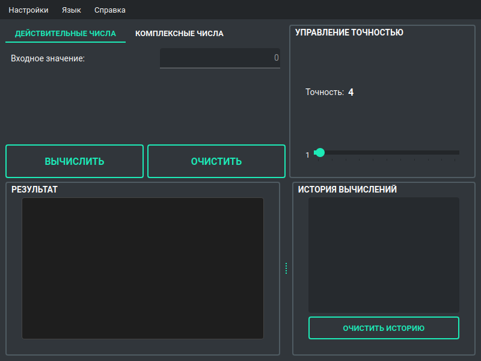
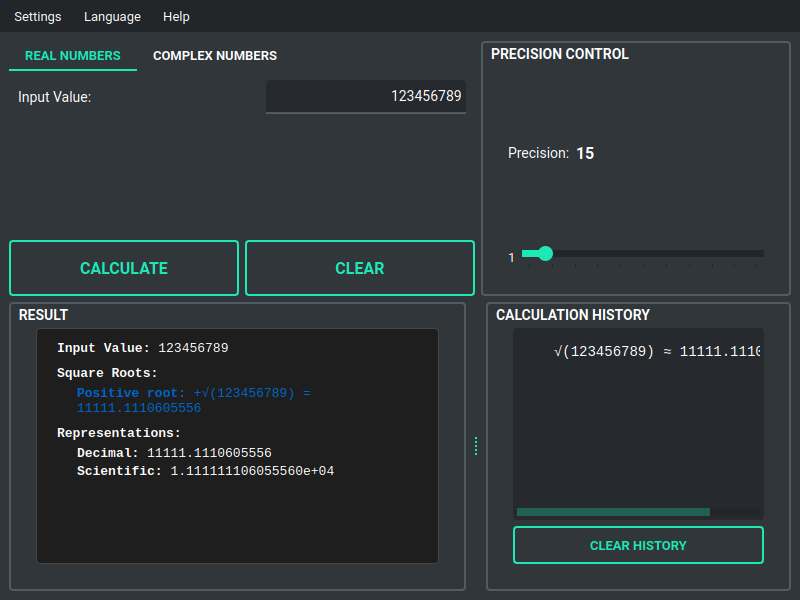
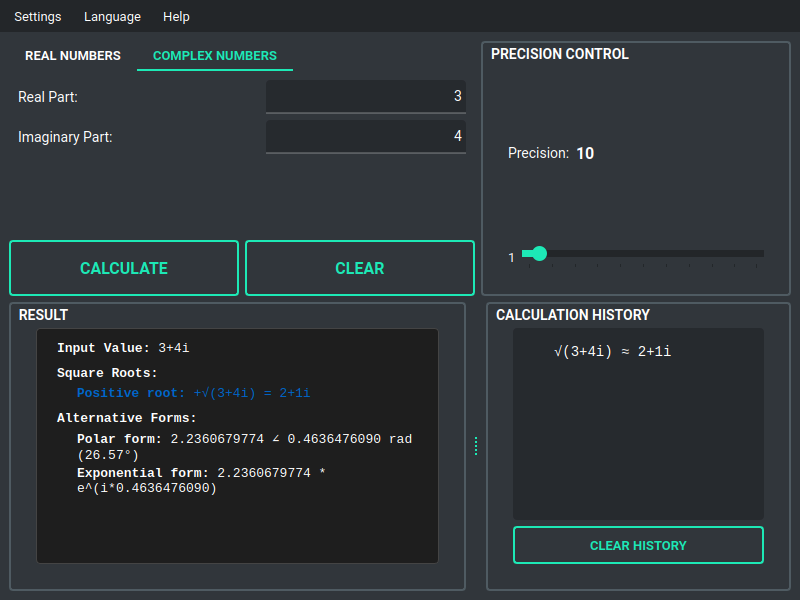
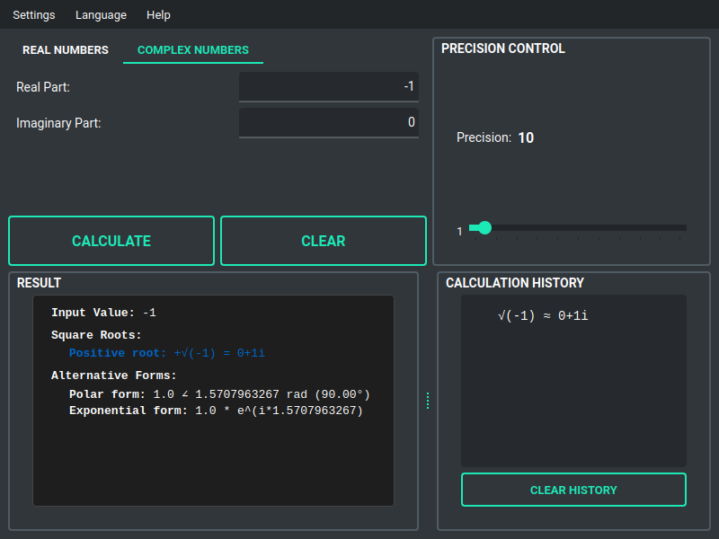

# Калькулятор квадратного корня

Комплексный кроссплатформенный калькулятор квадратного корня с поддержкой действительных чисел, комплексных чисел и произвольной точности вычислений.

## Скриншоты

### Начальный интерфейс
<div align="center">
  
  <p><i>Начальный интерфейс</i></p>
</div>

### Многоязычная поддержка
<div align="center">
  
  <p><i>Интерфейс на русском языке</i></p>
</div>

### Вычисления с действительными числами
<div align="center">
  
  <p><i>Вычисление √2 с точностью 30 знаков после запятой</i></p>
</div>

<div align="center">
  
  <p><i>Вычисление квадратного корня из больших чисел (123,456,789)</i></p>
</div>

### Поддержка комплексных чисел
<div align="center">
  
  <p><i>Интерфейс режима комплексных чисел</i></p>
</div>

<div align="center">
  
  <p><i>Вычисление √(3+4i) = 2+1i</i></p>
</div>

<div align="center">
  
  <p><i>Вычисление √(-1) = i в режиме комплексных чисел</i></p>
</div>

## Возможности

### Основной функционал
- **Поддержка действительных чисел**: Вычисление квадратных корней положительных действительных чисел
- **Поддержка комплексных чисел**: Вычисление квадратных корней комплексных чисел (a + bi)
- **Произвольная точность**: Настройка точности вычислений от 1 до 1000 знаков после запятой
- **Отображение всех корней**: Показывает положительный и отрицательный квадратные корни
- **Множественные представления**: Десятичная форма, научная нотация и дробные приближения

### Пользовательский интерфейс
- **Современный GUI**: Создан с помощью PyQt6 для нативного внешнего вида
- **Вкладки для навигации**: Интуитивное переключение между режимами действительных и комплексных чисел
- **Управление точностью**: Слайдер (1-200) для быстрой настройки + поле ввода (1-1000) для точных значений
- **Единообразный формат вывода**: Согласованное отображение для всех режимов вычислений
- **История вычислений**: Боковая панель с последними вычислениями и метками времени

### Дополнительные возможности
- **Многоязычный интерфейс**: Поддержка английского и русского языков
- **Проверка обновлений**: Автоматическая проверка новых версий из GitHub
- **Обработка ошибок**: Надёжная валидация ввода и сообщения об ошибках
- **Кроссплатформенность**: Работает на Windows и Linux
- **Темы оформления**: Светлая и тёмная темы
- **Постоянные настройки**: Сохранение предпочтений между запусками приложения

## Установка

Скачайте последнюю собранную версию для вашей платформы со страницы [GitHub Releases](https://github.com/ijo42/square-root-calculator/releases):

- **Windows**: Скачайте `square-root-calculator.exe`
- **Linux**: Скачайте `square-root-calculator` (ELF бинарник)

Для предварительно собранных исполняемых файлов установка Python не требуется!

## Использование

### Запуск приложения

**Windows**: 
- Дважды щелкните `square-root-calculator.exe`

**Linux**: 
```bash
chmod +x square-root-calculator
./square-root-calculator
```

### Работа с калькулятором

1. **Выберите режим вычисления**:
   - Используйте вкладки для переключения между **Действительные числа** и **Комплексные числа**

2. **Введите входные данные**:
   - **Режим действительных чисел**: Введите одно число в поле ввода
   - **Режим комплексных чисел**: Введите действительную и мнимую части отдельно

3. **Установите точность**: 
   - Используйте слайдер (1-200) для быстрой настройки
   - Используйте поле ввода (1-1000) для точных значений

4. **Вычислить**: Нажмите кнопку "Вычислить" для получения результата

5. **Просмотр результатов**:
   - Посмотрите положительный и отрицательный корни
   - Просмотрите различные представления (десятичное, научное, дробное)
   - Проверьте историю вычислений в боковой панели

6. **Смена языка**: Используйте меню Язык → English/Русский

### Примеры

#### Действительные числа
- Ввод: `16` → Результаты:
  - Положительный корень: `+√(16) = 4`
  - Отрицательный корень: `-√(16) = -4`
  
- Ввод: `2` → Результаты:
  - Положительный корень: `+√(2) = 1.4142135623730950488016887242096980785696718753769...`
  - Отрицательный корень: `-√(2) = -1.4142135623730950488016887242096980785696718753769...`
  - Научное: `1.414213562373095e+00`
  - Дробь: `1414/1000` (приближение)

#### Комплексные числа
- Действительная: `3`, Мнимая: `4` → Результаты:
  - Положительный корень: `2+1i`
  - Отрицательный корень: `-2-1i`
  
- Действительная: `-1`, Мнимая: `0` → Результаты:
  - Положительный корень: `0+1i` (эквивалентно √(-1) = i)
  - Отрицательный корень: `0-1i`

## Обновление приложения

Приложение включает автоматическую проверку обновлений, которая уведомит вас о доступности новых версий.

Для обновления:
1. Посетите страницу [GitHub Releases](https://github.com/ijo42/square-root-calculator/releases)
2. Скачайте последнюю версию для вашей платформы
3. Замените старый исполняемый файл новым

Вы также можете вручную проверить обновления через меню **Справка → Проверить обновления**.

## Документация

Для более подробной информации:
- [Примеры использования](docs/USAGE_EXAMPLES.ru.md) - Подробные сценарии использования и советы
- [Документация для разработчиков](docs/DEVELOPMENT.md) - Для контрибьюторов и разработчиков

## Поддержка

Для вопросов, запросов функций или сообщений об ошибках:
- Создайте issue на [GitHub Issues](https://github.com/ijo42/square-root-calculator/issues)
- Прочитайте [Примеры использования](docs/USAGE_EXAMPLES.ru.md) для типичных сценариев

## Лицензия

Этот проект с открытым исходным кодом и доступен по лицензии MIT.
